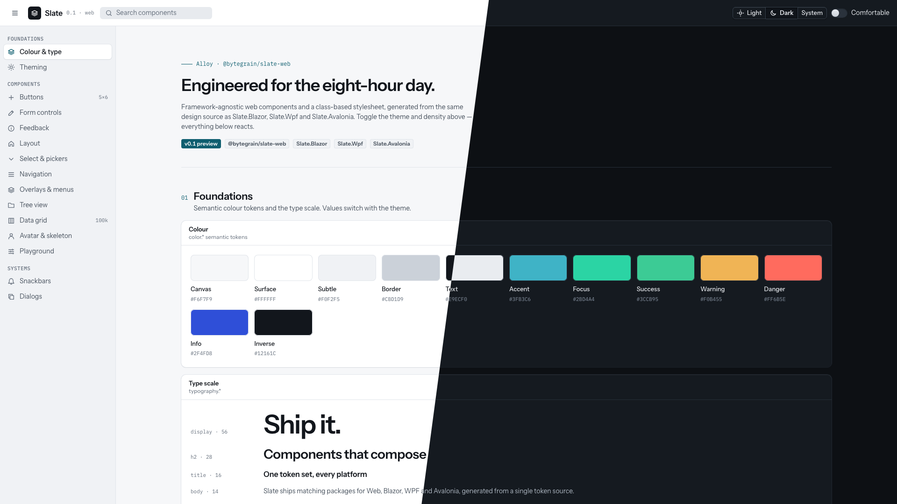

# Slate

<p align="center">
  <strong>One design system for web and desktop.</strong><br />
  Shared tokens, accessible themes, and carefully crafted components for Web, Blazor, WPF, and Avalonia.
</p>

<p align="center">
  <a href="https://github.com/bytegrain/slate/actions/workflows/ci.yml"></a>
  <a href="https://www.npmjs.com/package/@bytegrain/slate-web"></a>
  
</p>

<p align="center">
  
</p>

Slate is a component library built on **Alloy**, a calm, precise design language for professional software. Use framework-independent web components and CSS, or build native-feeling interfaces with Blazor, WPF, and Avalonia.

> **Preview software:** Slate is under active development. APIs and package contents may change between preview releases.

## Choose a platform

| Platform | Package | What it provides |
| --- | --- | --- |
| Web | [`@bytegrain/slate-web`](packages/web/README.md) | Lit web components and framework-independent CSS |
| Blazor | [`Slate.Blazor`](src/Slate.Blazor/README.md) | Razor components and services |
| WPF | [`Slate.Wpf`](src/Slate.Wpf/README.md) | Native WPF styles and Slate controls |
| Avalonia | [`Slate.Avalonia`](src/Slate.Avalonia/README.md) | Avalonia themes and Slate controls |
| Shared .NET foundation | [`Slate.Core`](src/Slate.Core/README.md) | Tokens, icons, and shared behavior used by the .NET packages |

## Install

The web package is public on npm:

```bash
npm install @bytegrain/slate-web
```

The .NET packages are currently hosted privately on GitHub Packages. They require access to the `bytegrain` packages and NuGet authentication. See the [package setup guide](docs/packaging.md).

## Quick start: Web

Import the stylesheet and component registrations, then use Slate elements in your markup:

```js
import '@bytegrain/slate-web/slate.css';
import '@bytegrain/slate-web';
```

```html
<sl-provider theme="system" density="compact">
  <sl-button variant="solid" tone="accent">Create project</sl-button>
</sl-provider>
```

The web components work with any framework; the stylesheet can also style static markup. See the [web package guide](packages/web/README.md) for setup and component details.

## What’s included

- **Shared design language:** light, dark, and system themes; compact and comfortable density; generated design tokens and icons.
- **Web:** Lit custom elements plus a class-based stylesheet that also works without JavaScript.
- **Blazor:** Razor components, theming, and shared snackbar and dialog services.
- **WPF and Avalonia:** native framework styling alongside Slate controls.
- **Rich component set:** inputs, layout, navigation, overlays, date and selection controls, and data grids.

See each [platform guide](#choose-a-platform) for setup and API examples.

## One design source

Slate's design tokens and icon definitions live in `design/`. A generator produces the platform resources and code, helping keep themes and component behavior consistent. The system includes light and dark themes, compact and comfortable density, and shared accessibility checks.

## Development

Requirements: .NET 10 SDK and Node.js 22 or later. WPF builds on any OS; its UI tests require Windows.

```bash
npm ci
npm test
npm run build
dotnet test Slate.slnx
```

After changing tokens or icons, regenerate platform outputs and verify they are current:

```bash
dotnet run --project tools/Slate.Tokens.Cli -- build
dotnet run --project tools/Slate.Tokens.Cli -- build --check
```

See the [architecture guide](docs/ARCHITECTURE.md), [design rules](docs/design/README.md), and [package setup guide](docs/packaging.md) for more.
